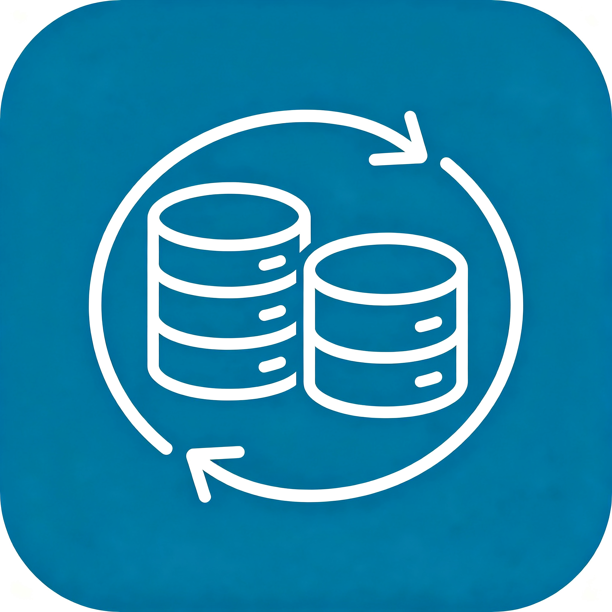
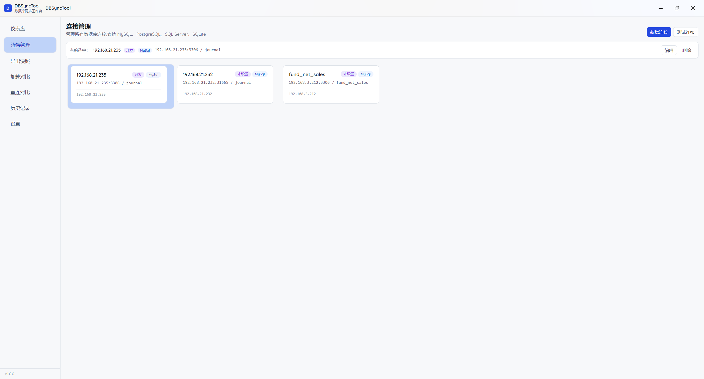
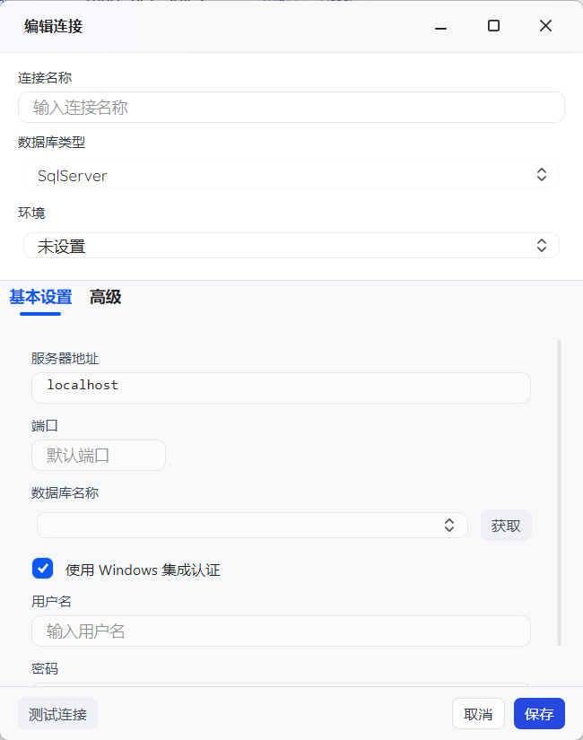
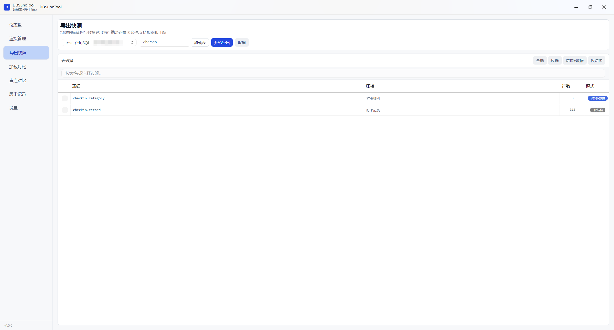
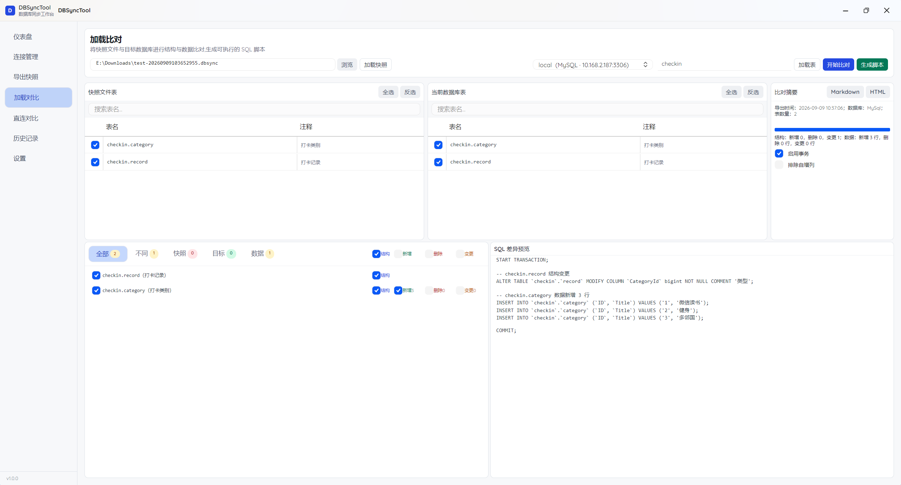
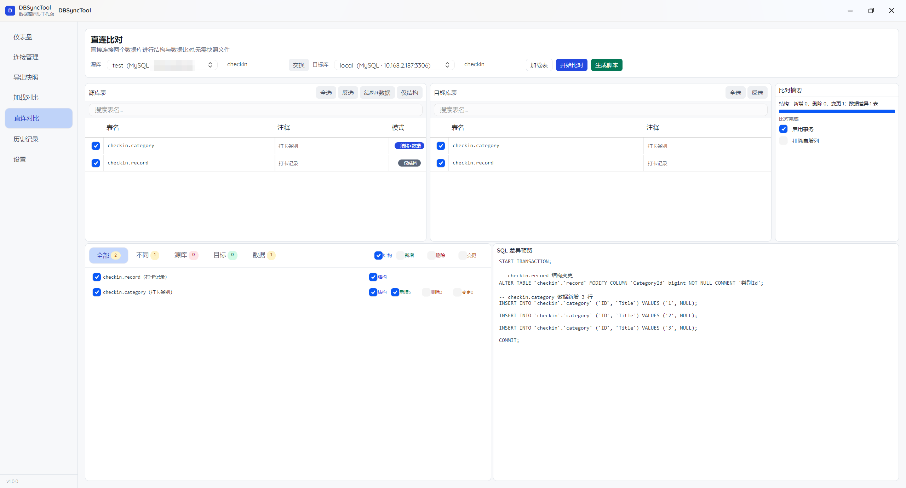
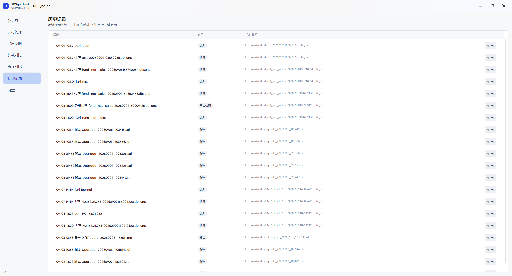
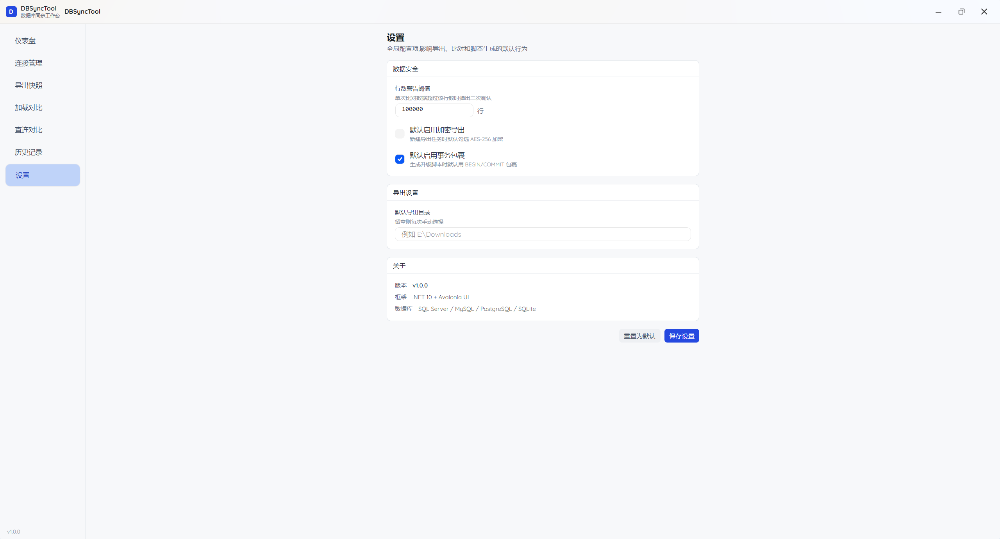

<div align="center">



# DBSyncTool

### Database Schema & Data Diff Tool with Sync Script Generation

[](https://github.com/wangbenchi66/DBSyncTool/releases)
[](https://microsoft.com/windows)
[](https://dotnet.microsoft.com/)
[](https://avaloniaui.net/)
[](LICENSE)
[](#acknowledgements)

<br/>

**[简体中文](README.md)** • **[English](README.en.md)**

<br/>

[📖 Use Cases](#scenario) • [🌟 Feature Overview](#highlights) • [✨ Screenshots](#features) • [💻 CLI](#cli) • [🚀 Quick Start](#download) • [🛠️ Build from Source](#build) • [📂 Project Structure](#structure) • [💡 Acknowledgements](#acknowledgements)

</div>

---

## <a id="scenario"></a>📖 Use Cases

DBSyncTool compares **schema differences** and **data differences** between two databases, and generates executable upgrade scripts. It offers two working modes depending on network connectivity:

### Snapshot Mode — Air-Gapped / No Direct Connection

Designed for scenarios where production and test databases **cannot access each other** (e.g. isolated intranet environments). The workflow has two steps:

1. **Target side** (machine with access to the target database) → Export a baseline snapshot file (`.dbsync`);
2. **Source side** (machine with access to the source database) → Load the snapshot and compare table-by-table against the source database, producing a diff report and executable SQL.

> 🔒 **Security**:
> - Snapshot files support **password encryption** — unauthorized access is blocked;
> - Snapshots **do not contain database connection info** — even if leaked, no server addresses or credentials are exposed;
> - No database ports need to be opened, no cross-network tunnels required — **zero network exposure**.
>
> 🚀 **Convenience**:
> - A single `.dbsync` file captures the entire baseline — transfer it via USB drive, internal file share, email, or any other channel;
> - Snapshots use **streaming export** — data fingerprint collection for millions of rows runs without loading entire tables into memory;
> - Choose "schema only" or "schema + data" per table to flexibly control snapshot size and comparison scope.

### Direct Connection Mode — Both Databases Accessible

When source and target databases are on the same network, **no snapshot is needed** — simply select two connections and compare online, skipping the file transfer step.

> 💡 **Common Design**:
> - **WYSIWYG**: Diffs are SQL — transaction wrapping, identity column exclusion, and other options are reflected in the preview in real time;
> - **Multi-database support**: SQL Server, MySQL, PostgreSQL, SQLite — unified workflow;
> - Both modes share the same comparison engine and SQL generator, producing identical results.

---

## <a id="highlights"></a>🌟 Feature Overview

| Area | Capabilities |
| :--- | :--- |
| **Schema Diff** | Column-by-column comparison of types, constraints, indexes, foreign keys, etc. |
| **Data Diff** | Primary-key-based hash fingerprinting with streaming export for millions of rows |
| **SQL Generation** | Diffs as SQL, with transaction wrapping, identity column exclusion, and rollback scripts |
| **Per-Table Control** | Each table can independently select "schema only" or "schema + data" |
| **Snapshot Encryption** | Password-protected snapshot files — matching password required for export/import |
| **Direct Compare** | Skip snapshots when both databases are accessible — compare directly |
| **Multi-Database** | SQL Server, MySQL, PostgreSQL, SQLite |
| **Desktop + CLI** | Avalonia GUI and `dbsync` command-line — two ways to use |
| **Auto Update** | GitHub Actions auto-packages on tag push; desktop app checks for updates on startup |

---

## <a id="features"></a>✨ Screenshots

### 1. 📋 Connection Management

Manage multiple database connections (database names support search/autocomplete). Passwords are encrypted and stored locally.

<div align="center">
  
  <br/><br/>
  
</div>

---

### 2. 📦 Export Snapshot (on the Target Side)

After selecting a connection, tables are loaded automatically. Check tables for "schema only" or "schema + data", set filter conditions, encryption, and export path. The `.dbsync` baseline snapshot is exported via streaming.

<div align="center">
  
</div>

---

### 3. 🔍 Compare (on the Source Side)

- **Snapshot Compare**: Load a snapshot file and compare against the source database;
- **Direct Compare**: When both databases are accessible, select two connections and compare directly.

Results are categorized as "All / Different / Source Only / Target Only / Data Diff". Check nodes to see the corresponding upgrade SQL in the preview panel.

<div align="center">
  
  <br/><br/>
  
</div>

---

### 4. 📜 History & Settings

History saves previous snapshots and comparison results for quick re-comparison. The settings page lets you adjust default behaviors for export, comparison, and script generation.

<div align="center">
  
  <br/><br/>
  
</div>

---

## <a id="cli"></a>💻 CLI

In addition to the desktop app, the `dbsync` CLI can be used on servers without a graphical interface:

```bash
# Export snapshot
dbsync export --connection "Server=...;Database=..." --output snapshot.dbsync

# Compare snapshot against target (exit code: 0 = no diff / 1 = has diff / 2 = error)
dbsync compare --snapshot snapshot.dbsync --connection "Server=...;Database=..."

# Generate upgrade script
dbsync script --snapshot snapshot.dbsync --connection "..." --output upgrade.sql

# Execute script against target
dbsync execute --snapshot snapshot.dbsync --connection "..."
```

---

## <a id="download"></a>🚀 Quick Start & Download

| Package | For | Description | Download |
| :--- | :--- | :--- | :--- |
| **Desktop (Recommended)** | All users | win-x64 self-contained, no .NET installation required | [⬇️ Download DBSync.Desktop](https://github.com/wangbenchi66/DBSyncTool/releases) |
| **CLI** | Servers / Automation | win-x64 self-contained, for headless environments | [⬇️ Download dbsync CLI](https://github.com/wangbenchi66/DBSyncTool/releases) |
| **Build from Source** | Developers | Requires .NET 10 SDK | See [Build from Source](#build) below |

### Basic Workflow:

1. Download the desktop zip, **extract the entire package**, then run `DBSync.Desktop.exe`;
2. Add database connections on the "Connection Management" page — passwords are encrypted locally;
3. On the target side, use "Export Snapshot" to create a `.dbsync` file and transfer it to the source side;
4. On the source side, use "Snapshot Compare" to view the diff report and SQL preview;
5. Export the upgrade script or execute it directly as needed.

> 💡 If both databases are accessible, skip the snapshot step and use "Direct Compare" instead.

---

## <a id="build"></a>🛠️ Build from Source

### Requirements
- Windows 10 / 11 (x64)
- [.NET 10 SDK](https://dotnet.microsoft.com/download/dotnet/10.0)

### Build & Run

```bash
# 1. Clone the repository
git clone https://github.com/wangbenchi66/DBSyncTool.git
cd DBSyncTool

# 2. Build
dotnet build src/DBSyncTool.slnx

# 3. Run desktop app
dotnet run --project src/DBSync.Desktop

# 4. Run CLI
dotnet run --project src/DBSync.CLI -- export --help

# 5. Run tests
dotnet test src/DBSyncTool.slnx
```

### Manual Publishing

See [docs/release.md](docs/release.md) for details on auto-packaging, version management, and the auto-update mechanism.

---

## <a id="structure"></a>📂 Project Structure

```text
DBSyncTool/
├── .github/workflows/              # GitHub Actions CI/CD
│   └── release.yml                 # Tag-triggered auto-packaging & release
├── src/
│   ├── DBSync.Core/                # Core domain & algorithms
│   │   ├── Models/                 # Table, column, index, FK, snapshot, diff models
│   │   ├── Schema/                 # Database schema readers
│   │   ├── Comparers/              # Schema diff, data diff, FK topological sort
│   │   ├── Data/                   # Row hashing & data fingerprinting
│   │   ├── Snapshot/               # Snapshot export, import, format, encryption
│   │   ├── SqlGenerators/          # SQL generators per database dialect
│   │   ├── Execution/              # Script executor
│   │   └── Versioning/             # App version parsing & comparison
│   ├── DBSync.Desktop/             # Avalonia desktop app (SukiUI theme)
│   │   ├── Views/                  # Main window, dashboard, export, compare, etc.
│   │   ├── ViewModels/             # Page view models
│   │   ├── Services/               # Window, encryption, export, update checker
│   │   ├── Storage/                # Local config & connection persistence
│   │   └── Helpers/                # IME input helpers, etc.
│   ├── DBSync.CLI/                 # CLI entry point (export / compare / script / execute)
│   └── DBSync.Tests/               # xUnit tests
├── docs/                           # Design docs, release notes, screenshots
├── Directory.Build.props           # Unified version management
├── LICENSE                         # MIT License
└── README.md                       # Project documentation (Chinese)
```

---

## Tech Stack

| Layer | Choice |
| :--- | :--- |
| Runtime | .NET 10 |
| Desktop UI | Avalonia UI 12 + SukiUI theme |
| MVVM | CommunityToolkit.Mvvm |
| Data Access | SqlSugar (Easy.SqlSugar.Core) |
| Logging | Serilog (Easy.Serilog.Core) |
| Testing | xUnit |
| Release | GitHub Actions (tag-triggered) |

---

## Contributing

1. Fork this repository
2. Create a feature branch
3. Commit your changes
4. Open a Pull Request

---

## <a id="acknowledgements"></a>💡 Acknowledgements

### 🤖 Human-AI Collaborative Development

This project is led by the developer for architecture design, interaction logic, and system tuning. AI agents assist with code construction and test verification.

### 📌 Maintenance

The project is under active development. Feel free to submit bug reports, feedback, or feature requests via [GitHub Issues](https://github.com/wangbenchi66/DBSyncTool/issues).

---

## <a id="license"></a>📄 License

This project is licensed under the [MIT License](LICENSE).
